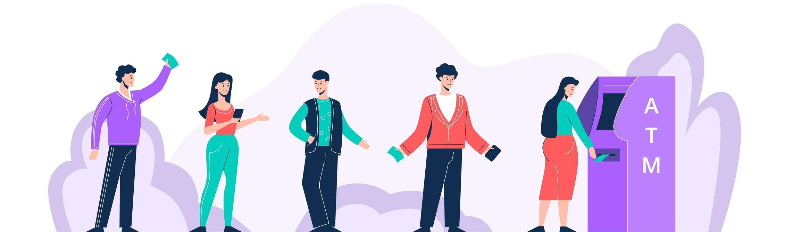
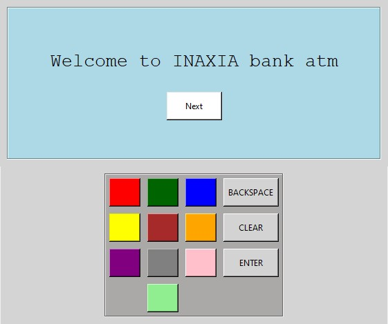
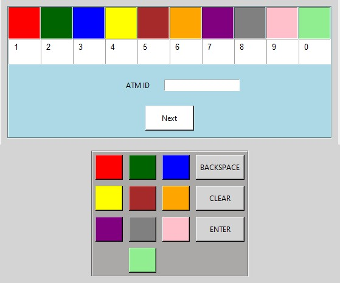
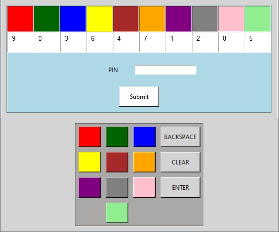
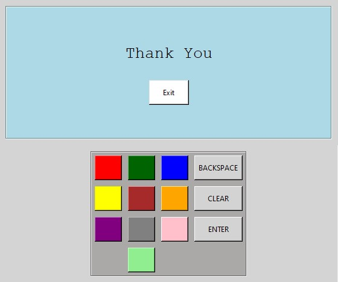

# Secure ATM
This project is made to make **Automated teller machine** more secure. It's simple nowadays to get your pin using hidden cameras, false keyboards, etc. So, here we are with a different idea to let your pin secure.

## Community
**[Code of Conduct](https://github.com/inaxia/attendance_using_face_recognition/blob/master/CODE_OF_CONDUCT.md)** 
**[Contributing to Inaxia](https://github.com/inaxia/attendance_using_face_recognition/blob/master/CONTRIBUTING.md)**

## Steps to Run
1. Fork this Repo
2. Clone that forked repo into your local system
3. Install `tkinter` library 
4. Run the code

Ignore the errors and warnings, it won't bother you
- Correct Atm id: **2020**
- Correct Pin: **6344**

## Demo video

## Screenshots

## Reference link
Image from Google: https://camo.githubusercontent.com/b3cf1d496fd5e53c5773d297dbe2cc6a13bbfec5714de8dc2bd0d8165e825b2f/68747470733a2f2f7374617469632e7665637465657a792e636f6d2f73797374656d2f7265736f75726365732f70726576696577732f3030312f3233332f3732332f6e6f6e5f32782f636172746f6f6e2d706f7369746976652d70656f706c652d7374616e64696e672d696e2d71756575652d61742d61746d2d766563746f722e6a7067

## Support
If you like this project, don't forget to give it a ⭐
